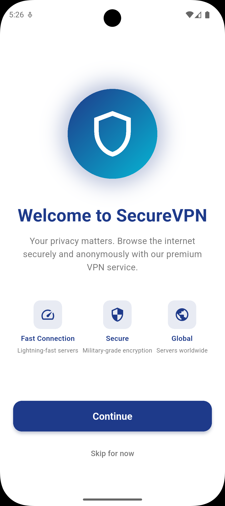
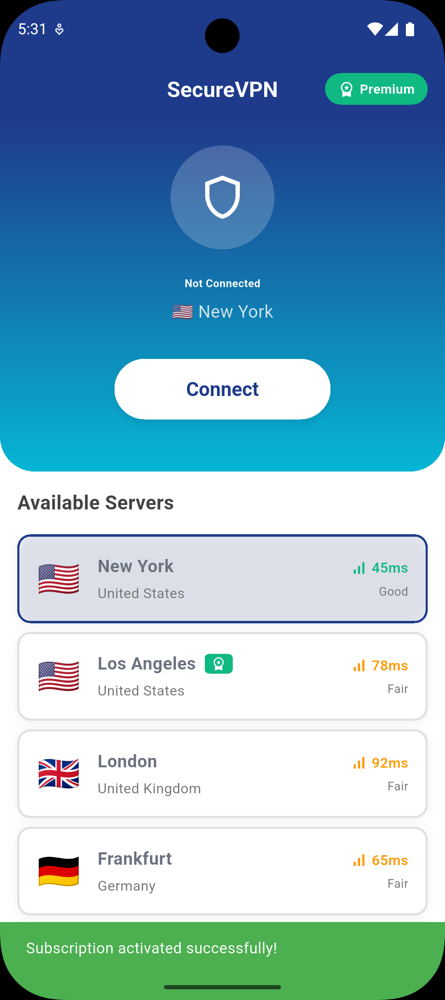
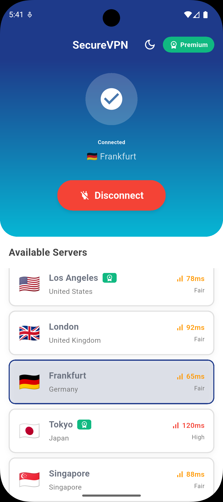

# SecureVPN - Flutter VPN Приложение

Приложение VPN с подпиской, реализованное на Flutter с использованием Clean Architecture и BLoC.

## 🚀 Особенности

- **Онбординг** - Приветственный экран с описанием возможностей
- **Paywall** - Экран с подписками (Месяц/Год со скидкой)
- **Главный экран** - Управление VPN подключением, выбор серверов
- **Сохранение состояния** - Подписка сохраняется между запусками приложения
- **Адаптивная тема** - Светлая/Тёмная тема
- **Чистая архитектура** - Domain/Data/Presentation слои

## 🛠️ Технологии

- **State Management**: BLoC (flutter_bloc)
- **DI**: GetIt
- **Навигация**: go_router
- **Хранение**: SharedPreferences
- **Тема**: adaptive_theme

## 📦 Структура проекта

```
lib/
├── config/              # Конфигурация (DI, роутер, темы)
├── feature/             # Фичи по Clean Architecture
│   ├── feature_onboarding/
│   ├── feature_paywall/
│   └── feature_mainpage/
└── main.dart
```

## 🏃 Запуск

```bash
flutter pub get
flutter run
```

## 🎨 Дизайн

- **Primary**: Синий (#1E3A8A)
- **Secondary**: Голубой (#06B6D4)
- **Accent**: Зелёный (#10B981)

## 📸 Скриншоты

| Онбординг | Paywall |
|-----------|---------|
|  |  |
| Приветственный экран с описанием возможностей | Выбор подписки: Месяц/Год |

| Главный экран (не подключен) | Главный экран (подключен) |
|-------------------------------|--------------------------|
|  |  |
| Выбор сервера и подключение | Активное VPN соединение |

## 📱 Навигация

```
/onboarding → /paywall → /main
```

Маршруты защищены: если подписка активна → переход сразу на главный экран.

## 💡 Как работает

1. При первом запуске показывается онбординг
2. Затем paywall с выбором подписки
3. После "покупки" открывается главный экран
4. Состояние подписки сохраняется в SharedPreferences
5. При следующем запуске - сразу главный экран

## 🔧 Тестирование

Кнопка "Skip for now" на онбординге позволяет пропустить paywall для тестирования.
